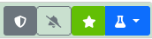

# Shared Process

## Lists

#### tools
{ align=right }
You will meet several lists in Labsmanager, for quite every items. 
There is some tools available for each, when available. 

**:fontawesome-solid-download:{ class="twemoji btn notif off mini middle"} download** : the first icon allow you to export a copy of the current list in different format : CSV, TSV, XLS, XLSX.

**:fontawesome-solid-rotate-right:{ class="twemoji btn notif off mini middle"} reload** : Just to reload the table

**:fontawesome-solid-filter:{ class="twemoji btn notif off mini middle"} Filter** : You can set different filters, generated by the type of datas. If you have several filters active, they are evaluated by an *[AND]* condition 

#### Actions
In the majority of tables, you will have access to direct action buttons depending on user rights,{ align=right }

**:fontawesome-solid-shield-halved:{ class="twemoji btn admin_active mini middle"} Admin** : brings you to the admin panel for the current item, to let bypass every limitation from the interface. As usual, you should know what you are doing in admin panel!

**:fontawesome-solid-pen-to-square:{ class="twemoji btn edit mini middle"} Edit** : open a modal to edit the current item. Only on its basic informations.

**:fontawesome-solid-trash:{ class="twemoji btn delete mini middle"} delete** : to delete the current item. Open a confirm modal before performing the deletion

## Panel

every information, card, tables, ... are displayed in panels, usually with a sidebar menu to navigate between panels in a thematic page (employee, project, teams, ...)

!!! info
    Panel that has other panels below are collapsable.

{ align=right }Some panel heading has tool buttons

:fontawesome-solid-shield-halved:{ class="twemoji btn admin middle"} **Admin Button**

direct access to admin panel for the current item. Only available when logged with a staff/admin account.

:fontawesome-solid-bell-slash:{ class="twemoji btn notif off hovered middle"} **Subscription Button**

Toggle button to activate subscription :fontawesome-solid-bell-slash:{ class="twemoji btn mini notif on middle"} or deactivate subscription :fontawesome-solid-bell-slash:{ class="twemoji btn mini notif off middle"}.
Subscription are used to add item to the email notification when activated.

:fontawesome-solid-star:{ class="twemoji btn notif off hovered middle"} **Favorite Button**

Toggle button to add item to favorites :fontawesome-solid-star:{ class="twemoji btn mini notif on middle"} or remove if from favorites :fontawesome-solid-star:{ class="twemoji btn mini notif off middle"}.
Favorite are direct link to item page in index panel or in dropdown menu "Favorites"

:fontawesome-solid-flask:{ class="twemoji btn menu middle"} **Menu Button**

Contextualized menu to provide actions. TO edit current item, add information, export, ....

## Calendar

All calendar through the app share the same behaviors, and views. 

### Views

#### bloc #1 by ressource

##### Month
a calendar displayed by ressoure (one line per employee) for a month, divided by days, which are subdivided by half day.

##### Bimensual
a calendar displayed by ressoure (one line per employee) for a two month divided by weeks, which are subdivided by day.

##### Year
a calendar displayed by ressoure (one line per employee) for a whole year (jan to jan) divided by month

##### fortnight
a calendar displayed by ressoure (one line per employee) for a fortnight, divided by days, which are subdivided by half day.

#### bloc #2 Standard

##### Month
a standard monthly calendar, divided by days

##### week 
a standard weekly calendar, divided by days

##### Planning 
a list of leaves for a week

##### Year
a standard yearly calendar, divided by month in column

#### bloc #3 Specific

##### Month
a calendar displayed by ressoure (one line per employee) for a month, divided by days, which are subdivided by half day, with 1 week sliding

