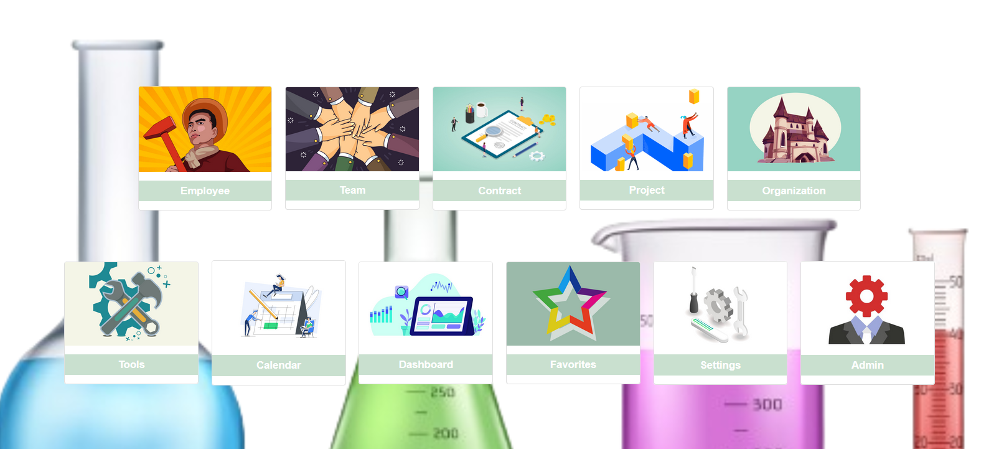

# Welcome to LabsManager Doc

{ align=left class="shadow" }**LabsManager** is a Django project to help in science lab management!

It helps you follow the labs project, including fund, expense, people involved, contract, milestinones, teams, leaves, etc...
It has email notification feature, ....

It's developped into a typical French science lab (bio/care), so it reflects funding process, tutellary management and so one in France.

With LabsManager you reference Employee, Projects, Funds, Leaves, ...
You can subscribe to some items to get periodic report by mail about them. 

Labsmanager is designed to down complexify (!) management system to provide decisionnal rationnal. It comes from the tests of several ERP system that are overkill, and involve a full responsability over the management of the structure, which labs have not.

{class="shadow" }
LabsManager Hub, for an admin login

!!! note
    This project is under active development.

    Current versions are beta ones

